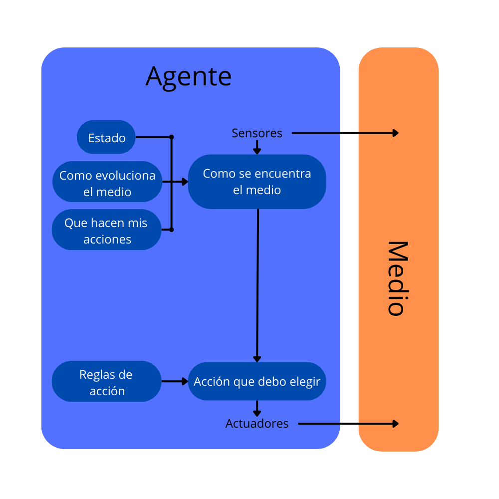
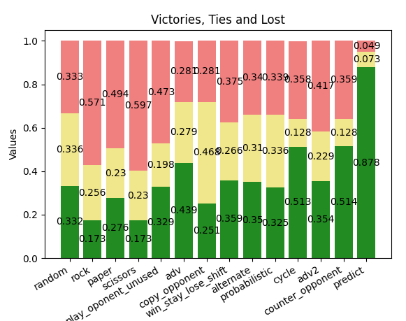
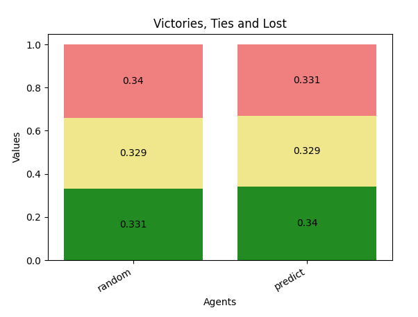
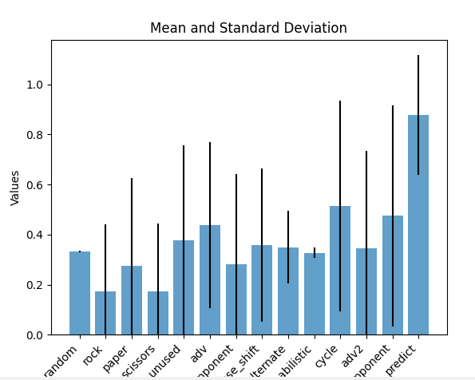

# RPS

Agente inteligente para Piedra, Papel, Tijeras

Este codigo permite enfrentar multiples agentes inteligentes y obtener graficos de los resultados

## Uso

- Añadir agentes en el archivo rps_agents.py y agregarlos en RPS_AGENTS
- Elegir modo de juego y numero de partidas al ejecutar el main
- Ejecutar

## Entorno de tareas

Entorno de tareas | Observable| Agentes | Determinista | Episódico | Estático | Discreto | Conocido
:---: | :---: | :---: | :---: | :---: | :---: | :---: | :---: |
 RPS | Parcial | Multi | [Estocástico](#conclusiones) | [Episódico](#conclusiones) | Estático | Discreto | Conocido |

## Estructura del agente



## Conclusiones

El agente elegido, que busca predecir al oponente, es altamente efectivo contra otros agentes.



De todas formas, este juego es episódico y estocástico. En el momento en que ambos agentes comienzan a usar algún tipo de estrategia, se puede volver secuencial y determinista. Un alto número de victorias por parte de un agente en este test solo implica que es mejor que el resto de los agentes contra los que compite, y no necesariamente el mejor. La estrategia más óptima seguirá siendo elegir de forma aleatoria para maximizar los resultados. De esta manera, evitamos patrones predecibles que puedan ser explotados, como se demuestra al enfrentarla contra la estrategia de predicciones y porque mantiene la varianza más baja.




## Extensión

- Añadir agentes en el archivo rpsls_agents.py y agregarlos en RPSLS_AGENTS
- Elegir modo de juego y numero de partidas al ejecutar el main
- Ejecutar

El agente de predicción es igual de eficaz que en el modo de juego normal

## Requisitos

- Python 3.12.2
- Numpy 1.26.4
- Matplotlib 3.8.3
- Pytest

## Instalación

- Crear directorio
- Clonar el proyecto
- Inicializa el entorno virtual y actívalo.
```bash
$ python3.12 -m venv venv
$ source venv/bin/activate
```
- Instala las dependencias.
```bash
$ pip install -r requirements.in
```


